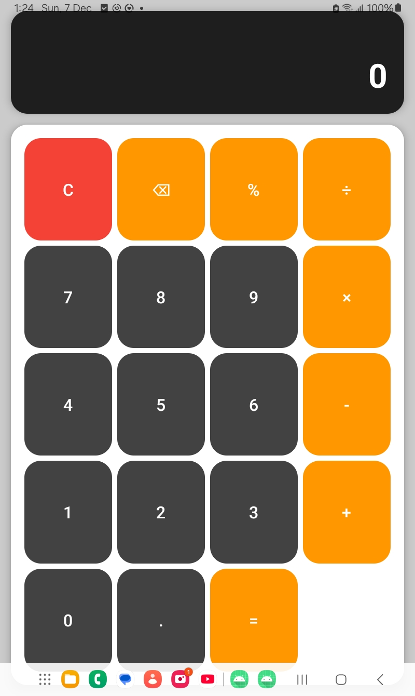
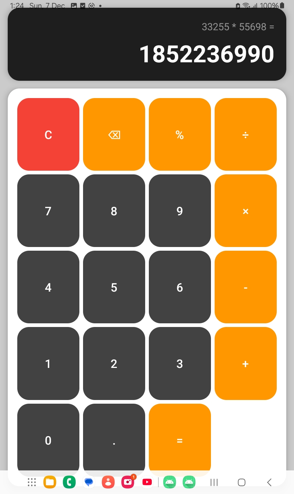

#  Android Calculator App (Kotlin)

A fast, clean, and minimal **Calculator App** built using **Kotlin** and **Android Studio**.  
Designed with a simple UI and smooth functionality — perfect as a starter Android project.

##  Features

-  Basic arithmetic operations (Add, Subtract, Multiply, Divide)
-  Clean and responsive UI  
-  Fast processing  
-  Handles divide-by-zero safely  
-  Works on all screen sizes  

## Tech Stack

- **Kotlin**
- **Android Studio**
- **XML Layouts**
- **View Binding**
- **MVVM (if you used it — remove if not)**

##  Screenshots
### Home Screen

### Calculator UI

